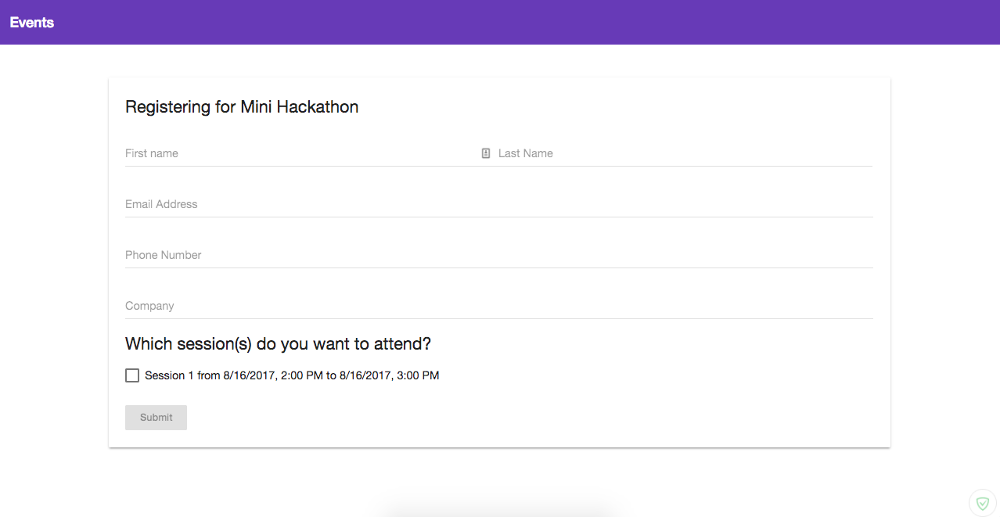
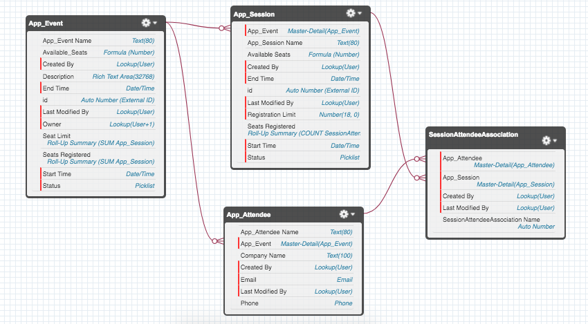

# EventWorks
EventWorks is an event management application that integrates the Salesforce REST API for database management and administration with a Angular frontend through a Node.js backend built on Express. Event planners can add events to be displayed on this app along with details such as event descriptions, event sessions, start/end times, seat availability, and more through the Salesforce website. Event goers can use the UI (https://eventworks.herokuapp.com/) to browse through events that are listed and register for events and sessions by providing a name, email address, phone number, and company name. Once registered, an email will be sent to event goers via Salesforce to confirm registration.

## Built with
* Angular - Client-side
* Express - Server-side
* Salesforce - Database
* Heroku - Deployment

## MVP
- [x] Potential attendees can see a list of events on the homepage along with basic details for the event such as title, start time, end time, status, registration limits, and remaining seats
- [x] Potential attendees can click on an event to view an event details page that includes an event description and event sessions
- [x] Potential attendees can click on a registration button on the events detail page that forwards them to a form that allows input of basic attendee information including name, email, phone number, company name, and the sessions that the attendee wants to attend
- [x] Only open events have registration features
- [x] Attendee receives a confirmation email after registration
- [x] Salesforce users can create events
- [x] Salesforce users can create sessions under an event
- [x] Salesforce users can create attendees under an event and add them to multiple event sessions
- [x] The application is responsive
- [x] The application is deployed on Heroku (https://eventworks.herokuapp.com/)

## Stretch Goals
- [ ] Add error handling
- [ ] Add sorting features to the homepage
- [ ] Add account creation to save user profiles and manage attending events
- [ ] Automate testing and deployment
- [ ] Add animations on load
- [ ] Reconfigure server-side API with promises instead of callbacks

## Database Schema

